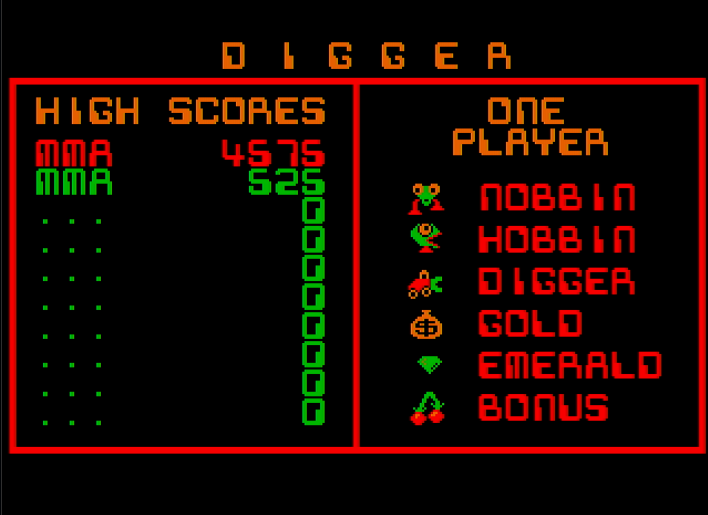
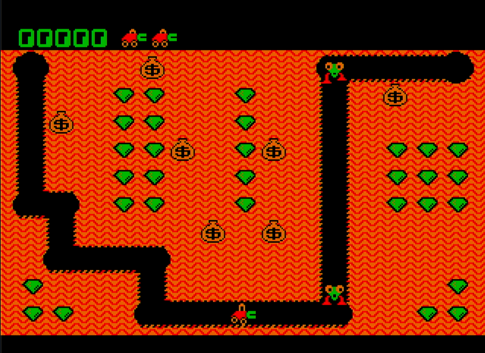

# MurmDigger

Digger Remastered for RP2350 (Raspberry Pi Pico 2) with HDMI display, PS/2 keyboard, and I2S audio.

## Screenshots

| Title Screen | Gameplay |
|:---:|:---:|
|  |  |

## About

[Digger](https://en.wikipedia.org/wiki/Digger_(video_game)) is a classic arcade-style PC game created by Windmill Software in 1983 for the IBM PC. Players control a digger collecting emeralds and gold while avoiding monsters called Nobbins and Hobbins.

In 1998, Andrew Jenner reverse-engineered the original x86 binary and created [Digger Remastered](http://www.digger.org) — a portable C reimplementation that preserved the original gameplay. Maksym Sobolyev ([sobomax](https://github.com/sobomax/digger)) later extended the project with SDL support, Linux compatibility, and various improvements.

MurmDigger is a bare-metal port of Digger Remastered to the RP2350 microcontroller, using CGA 4-color graphics mode for a minimal flash footprint (~347 KB UF2). It outputs video over HDMI via PIO, reads input from a PS/2 keyboard, and plays audio through an I2S DAC — all without an operating system.

## Note on Title Screen

The original CGA implementation in sobomax/digger had `cgatitle()` as a stub — it returned immediately without drawing anything. The VGA version had full title graphics including the Windmill Software copyright text. Since this port uses CGA mode, that copyright text was never part of the source code we inherited. The title screen with the red border, high score table, and game character descriptions was added as part of this port.

## Supported Boards

This firmware is designed for the following RP2350-based boards with integrated HDMI, PS/2 and I2S:

- **[Murmulator](https://murmulator.ru)** — A compact retro-computing platform based on RP Pico / Pico 2, designed for emulators and classic games.
- **[FRANK](https://rh1.tech/projects/frank?area=about)** — A versatile development board based on RP Pico 2, HDMI output, and extensive I/O options.

Both boards provide all necessary peripherals out of the box — no additional wiring required.

## Hardware Requirements

- **Raspberry Pi Pico 2** (RP2350) or compatible board
- **HDMI connector** (directly connected via resistors, no HDMI encoder needed)
- **PS/2 keyboard** (directly connected)
- **I2S DAC module** (e.g., TDA1387 or PCM5102)

## Pin Tables

Two GPIO layouts are supported: **M1** and **M2**.

### HDMI (via 270 ohm resistors)

| Signal | M1 GPIO | M2 GPIO |
|--------|---------|---------|
| CLK-   | 6       | 12      |
| CLK+   | 7       | 13      |
| D0-    | 8       | 14      |
| D0+    | 9       | 15      |
| D1-    | 10      | 16      |
| D1+    | 11      | 17      |
| D2-    | 12      | 18      |
| D2+    | 13      | 19      |

### PS/2 Keyboard

| Signal | M1 GPIO | M2 GPIO |
|--------|---------|---------|
| CLK    | 0       | 2       |
| DATA   | 1       | 3       |

### I2S Audio

| Signal | M1 GPIO | M2 GPIO |
|--------|---------|---------|
| DATA   | 26      | 9       |
| BCLK   | 27      | 10      |
| LRCLK  | 28      | 11      |

## Controls

### Single Player

| Key          | Action          |
|--------------|-----------------|
| Arrow keys   | Move digger     |
| F1           | Start one-player game |
| Space        | Fire            |
| F7           | Toggle music    |
| F9           | Toggle sound    |
| F10          | Exit game       |

### Two Players

| Key          | Action (Player 2) |
|--------------|--------------------|
| W            | Up                 |
| A            | Left               |
| S            | Down               |
| D            | Right              |
| F2           | Start two-player game |

## Building

### Prerequisites

1. Install the [Raspberry Pi Pico SDK](https://github.com/raspberrypi/pico-sdk) (version 2.0+)
2. Set environment variable: `export PICO_SDK_PATH=/path/to/pico-sdk`
3. Install ARM GCC toolchain

### Build

```bash
# Clone the repository
git clone https://github.com/rh1tech/murmdigger.git
cd murmdigger

# Default build: M2 board, 252 MHz
./build.sh

# Build for M1 board
./build.sh -b M1

# Build with custom CPU speed
./build.sh -c 378
```

### Flash

```bash
# With device in BOOTSEL mode:
picotool load build/murmdigger.uf2

# Or with device running:
./flash.sh
```

## License

The RP2350 port code is licensed under the **GNU General Public License v3.0 or later** — see [LICENSE](LICENSE) for details.

The original Digger Remastered source code by Andrew Jenner and Maksym Sobolyev retains its original BSD-2-Clause and GPL-2.0 licenses, as noted in the individual file headers.

## Author

**Mikhail Matveev** <[xtreme@rh1.tech](mailto:xtreme@rh1.tech)>, [https://rh1.tech](https://rh1.tech)

## Acknowledgments

### Windmill Software
- **Digger** (1983) — The original IBM PC game.

### Andrew Jenner
- **[Digger Remastered](http://www.digger.org)** (1998-2004) — Reverse-engineered portable C reimplementation of the original x86 binary.

### Maksym Sobolyev / Sippy Software
- **[sobomax/digger](https://github.com/sobomax/digger)** — SDL port, Linux support, and ongoing maintenance.
- **License:** BSD-2-Clause

### Michael Knigge
- Code cleanup and bug fixes for the sobomax/digger codebase.

### Raspberry Pi (Trading) Ltd.
- **[pico-extras](https://github.com/raspberrypi/pico-extras)** — Audio I2S PIO library.
- **License:** BSD-3-Clause

### Ha Thach / tinyusb
- **[tinyusb](https://github.com/hathach/tinyusb)** — HID keycode definitions.
- **License:** MIT

### PS/2 PIO Keyboard Driver
- PS/2 keyboard PIO code for RP2040/RP2350.
- **License:** GPL-2.0-or-later
